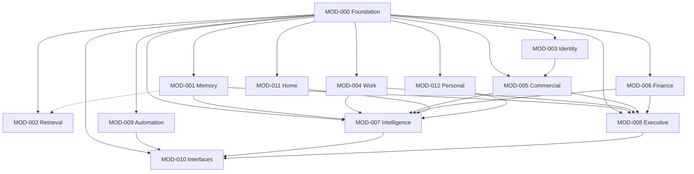

# EDN OS Module Map

> **Knowledge Compounds.**

Directional architecture for durable EDN OS modules. This map guides **ownership**
and **dependency direction**. It does not authorise implementation of every module
listed here.

Approved module specifications live in `MODULE-NNN-*.md`. Platform structure and
contracts live in `ARCHITECTURE.md`.

---

## Purpose

Document the current durable module model while clearly distinguishing:

- **Approved architecture** — modules with authorised specifications and/or implementation;
- **Provisional boundaries** — directional ownership not yet approved for build;
- **Candidate modules** — long-term ownership guidance only.

The map supports ownership and dependency decisions without committing EDN OS to
speculative implementations.

---

## Module catalogue

| ID | Module | Status | Specification |
|----|--------|--------|---------------|
| MOD-000 | Foundation | **Approved** (partly implemented) | `MODULE-000-FOUNDATION.md` |
| MOD-001 | Memory | **Approved** | `MODULE-001-MEMORY.md` |
| MOD-002 | Retrieval | **Provisional** | — |
| MOD-003 | Identity & Relationships | Candidate | — |
| MOD-004 | Work | **Approved (Universal Work Capture V1 only)** | `MODULE-004-WORK.md` |
| MOD-005 | Commercial | Candidate | — |
| MOD-006 | Finance | Candidate | — |
| MOD-007 | Intelligence | Candidate | — |
| MOD-008 | Executive | Candidate | — |
| MOD-009 | Automation | Candidate | — |
| MOD-010 | Interfaces | Candidate | — |
| MOD-011 | Home & Environment | Candidate | — |
| MOD-012 | Personal | Candidate | — |

Module numbers are **stable architecture identities**, not build order. Development
priority remains revenue-first and value-driven.

---

## Approved status

### MOD-000 — Foundation

**Approved and partly implemented.**

Provides shared platform primitives: configuration, approved runtime paths,
logging, platform errors, version metadata, genuinely shared types, and generic
file fingerprinting. Must not depend on feature modules.

### MOD-001 — Memory

**Approved.** Outlook PST is the first source-adapter implementation.

Owns durable knowledge records, provenance, sensitivity classification,
attachments, and source adapters. Future source domains (Microsoft 365,
SharePoint, documents, photos, notes, calendar, voice) are **not currently
authorised**.

### MOD-002 — Retrieval

**Provisional module boundary.**

Module 001 may initially deliver minimal SQLite FTS5 keyword search for Memory
records. Expanding **cross-domain retrieval** — search, filtering, ranking, and
citation presentation across modules — should move into MOD-002 when evidence
warrants a separate durable module.

### MOD-004 — Work

**Approved for Universal Work Capture V1 only.**

Owns the source-neutral human-fact Work Capture event, reference-only evidence,
append-only correction lineage and deterministic projection intents. The wider
project/task/deliverable/asset candidate scope is not approved by this increment.

### MOD-003 and MOD-005 through MOD-012

**Candidate modules only.** They guide long-term ownership but are **not authorised
for implementation**. Boundaries may change after implementation evidence.

---

## Ownership definitions

### MOD-000 — Foundation

**Owns:**

- configuration;
- approved runtime paths;
- platform logging;
- platform errors;
- version metadata;
- genuinely shared platform types;
- generic file fingerprinting.

**Must not** depend on feature modules.

---

### MOD-001 — Memory

**Owns:**

- source archives;
- import runs;
- canonical knowledge records;
- provenance;
- sensitivity classification;
- attachments;
- source adapters;
- Outlook PST initial implementation.

**Future possible source domains** (not authorised): Microsoft 365, SharePoint,
documents, photos, notes, calendar, voice records.

---

### MOD-002 — Retrieval

**Candidate ownership:**

- keyword and phrase search;
- filtering;
- record retrieval;
- ranking;
- provenance/citation presentation;
- future semantic retrieval.

**Must not** own authoritative records. Retrieval finds records owned by domain
modules such as Memory.

---

### MOD-003 — Identity & Relationships

**Candidate ownership:**

- people;
- organisations;
- contact identities;
- entity resolution;
- relationship histories.

CRM (MOD-005) must reference Identity — not own the canonical person model.

---

### MOD-004 — Work

**Approved V1 ownership:**

- canonical meaningful-work capture;
- work duration, outcome and billing/rate classification;
- project/client references and versioned project defaults;
- follow-up intent and evidence/knowledge candidacy;
- reference-only evidence and secure-site/photo policy; and
- append-only corrections and deterministic projection intents.

**Candidate ownership beyond V1:**

- projects;
- tasks;
- timesheets;
- deliverables;
- assets;
- operational handovers.

---

### MOD-005 — Commercial

**Candidate ownership:**

- CRM;
- leads;
- opportunities;
- quotes;
- contracts;
- business-development follow-up.

References canonical people and organisations from MOD-003.

---

### MOD-006 — Finance

**Candidate ownership:**

- invoices;
- expenses;
- cash-flow views;
- Xero integration;
- future banking and investment summaries.

Specialist domain — not a dependency of lower platform layers.

---

### MOD-007 — Intelligence

**Candidate ownership:**

- summarisation;
- recommendations;
- risk detection;
- opportunity detection;
- decision support;
- AI-provider adapters.

AI outputs remain **derived** and must reference authoritative source records.
Intelligence is not the source of truth.

---

### MOD-008 — Executive

**Candidate ownership:**

- morning briefing;
- priorities;
- approvals;
- alerts;
- cross-module executive views.

Combines domain information but **must not** own underlying business records or
domain logic.

---

### MOD-009 — Automation

**Candidate ownership:**

- rules;
- triggers;
- scheduled workflows;
- approval gates;
- action execution;
- action audit.

Automation must not bypass module permissions or human-approval policies.

---

### MOD-010 — Interfaces

**Candidate ownership:**

- CLI;
- web/desktop;
- mobile;
- email/Teams interactions;
- voice/Jarvis interface.

Jarvis is an **interface to EDN OS**, not a separate source of truth. Interfaces
call application services; they do not directly manipulate stores.

---

### MOD-011 — Home & Environment

**Candidate ownership:**

- Home Assistant connector;
- sensors;
- presence;
- energy;
- irrigation;
- room-level voice devices;
- physical-environment events.

Home Assistant remains responsible for reliable device control and local fallback
automations. EDN OS ingests and reasons; it does not replace HA as the control plane.

---

### MOD-012 — Personal

**Candidate ownership:**

- family administration;
- property;
- health and fitness;
- travel;
- private personal records;
- personal financial views and vault boundaries.

Specialist domain — not a dependency of lower platform layers.

---

## Dependency principles

1. **Foundation** may be used by every module but imports no feature module.
2. **Memory** owns durable records; **Retrieval** finds but does not own them.
3. **Identity** owns canonical people and organisations; **Commercial (CRM)**
   references them.
4. **Executive** aggregates information but does not own domain logic.
5. **Intelligence** creates derived outputs that cite authoritative records.
6. **Automation** invokes module-approved actions and cannot bypass approval gates.
7. **Interfaces** call application services; they do not directly manipulate stores.
8. **Personal**, **Finance**, and **Home** are specialist domains, not dependencies
   of lower platform layers.
9. **Avoid circular dependencies.**
10. **Connectors** belong to the domain module they feed unless repeated evidence
    justifies extracting shared connector infrastructure into Foundation.

---

## Dependency diagram



Plain-text fallback:

```
MOD-000 Foundation
  ↑ used by all modules; imports nothing upstream

MOD-001 Memory ──(finds via)──▶ MOD-002 Retrieval [provisional]
MOD-003 Identity ──(referenced by)──▶ MOD-005 Commercial

MOD-007 Intelligence ◀── derived from domain modules (Memory, Work, Commercial, …)
MOD-008 Executive    ◀── aggregates domain modules (read-only views)
MOD-009 Automation   ──▶ module-approved actions (via gates)
MOD-010 Interfaces   ──▶ application services (CLI, UI, voice/Jarvis)

MOD-011 Home, MOD-012 Personal, MOD-006 Finance — specialist domains at the edge
```

Solid arrows in the Mermaid diagram indicate direct dependency on Foundation.
Dotted lines indicate read/query or derived-data relationships, not ownership.

---

## Architecture cautions

- This is a **directional map**, not approval to build all modules.
- **Candidate boundaries** may change after implementation evidence.
- Do **not** create empty Python packages for candidate modules.
- Do **not** add plugin registries, event buses, or generic integration frameworks
  without explicit architectural approval.
- Shared infrastructure moves to **Foundation** only when at least two durable
  modules require it, or it is essential platform governance.
- **Module numbers** represent stable identities, not build order.
- **Development priority** remains revenue-first and value-driven.
- **Approved module requirements** in `MODULE-000-*.md` and `MODULE-001-*.md`
  are unchanged by this map.

---

## Related documents

| Document | Role |
|----------|------|
| `CONSTITUTION.md` | Immutable principles |
| `ARCHITECTURE.md` | Platform structure and MOD-000/MOD-001 contracts |
| `MODULE-000-FOUNDATION.md` | Foundation specification |
| `MODULE-001-MEMORY.md` | Memory specification |
| `SECURITY.md` | Security controls |

---

© EDN Systems
