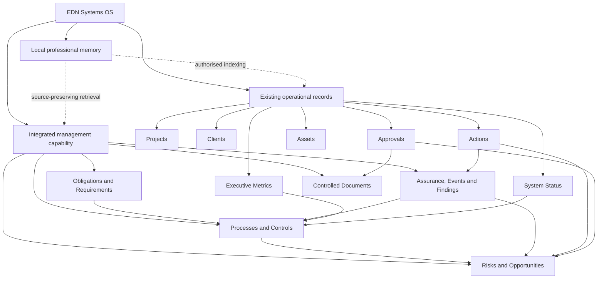

# EDN Integrated Management System Architecture

Status: Proposed architecture for owner review  
Date: 2026-08-05  
Scope: EDN Systems OS repository and future SharePoint implementation  
Live tenant changes: None in this phase

## 1. Purpose

EDN IMS is the integrated governance and assurance layer of EDN Systems OS. It
must help EDN operate consistently, safely, securely and with demonstrable
control without turning a one-person engineering consultancy into a compliance
administration project.

The initial alignment targets are:

- ISO 9001 quality management;
- ISO 45001 work health and safety (WHS);
- ISO/IEC 27001 information security;
- the Australian Essential Eight maturity model;
- ISO 31000-informed risk management.

The architecture must later accommodate ISO 14001, ISO 22301 and DISP by adding
requirements and mappings, not by creating new software silos.

Certification readiness means EDN can define scope, operate controls, retain
evidence, assess performance and demonstrate improvement. It does not imply
certification, conformity, or a current maturity level.

## 2. Evidence basis and current state

The repository contains ten source artifacts and has no committed Git history.
The current release is an Executive Dashboard package rather than the full EDN
Systems OS bootstrap implementation.

Observed facts:

- `README.md` defines EDN Systems OS as a modular Microsoft 365 operating system
  and SharePoint as the current operational data layer.
- `Documentation/Executive-Dashboard-v2.2.md` requires dashboard results to link
  to authoritative SharePoint list views and explicitly avoids a second
  reporting model.
- `SharePoint/dashboard.config.json` references Projects, Actions, Work Log,
  Quotes, Approvals and Engineering Knowledge.
- `Installer/Deploy-ExecutiveDashboard.ps1` also references Executive Metrics
  and System Status and provisions only page, navigation, theme and assets.
- The dashboard deployment is repeatable and supports `ShouldProcess`, but it
  contains no IMS schema or control workflows.
- `README.md` states that the separate Installer v1.6 remains the bootstrap
  installer; that installer and the schemas it creates are not present here.

Owner-stated structures—Clients and Assets—are treated as existing concepts, but
their live or installer schemas are not evidenced by this repository. They must
be discovered before implementation.

## 3. Architectural principles

1. **One operating system.** EDN IMS is a capability of EDN Systems OS, not a
   parallel portal, database, or compliance application.
2. **One record for one business fact.** Projects, clients, actions, assets,
   approvals and metrics remain authoritative in their existing structures.
3. **Standards are mappings.** ISO clauses, Essential Eight requirements,
   legislation and client obligations map to processes and controls; they are
   not permanent modules or separate registers.
4. **Integrated risk.** Quality, WHS, information security, commercial,
   delivery, environmental and continuity risks share one risk-and-opportunity
   model with typed contexts and views.
5. **Evidence by reference.** IMS records link to the source item, document,
   approval, asset, project, action or professional-memory evidence. Copies are
   avoided unless retention or access requirements require a controlled
   snapshot.
6. **Human authority.** Automation and AI may suggest classifications,
   summaries, relationships or actions. Only an accountable human can approve
   policies, accept risks, close findings, approve exceptions or attest control
   effectiveness.
7. **Proportional control.** Required fields and workflows must reflect the risk
   and EDN's size. A low-risk record should not need an enterprise workflow.
8. **Auditable change.** Ownership, status, approval, version, timestamps and
   source links are retained using SharePoint versioning and explicit decision
   records.
9. **Local-first compatibility.** Local professional-memory modules may index
   or enrich authorised records, but SharePoint remains the current operational
   system of record and provenance must survive round trips.
10. **Versioned external requirements.** Standards and maturity guidance change.
    Every requirement mapping records its source, edition and review date.

## 4. Target information architecture



### 4.1 Existing structures to extend

| Structure | Role in EDN IMS | Minimum extension |
|---|---|---|
| Projects | Delivery scope and project-level context | IMS relevance, linked risks, controls, obligations and findings; do not create project risk registers |
| Clients | Interested parties and client obligations | Legal/contractual requirements, assurance needs, data classification and review date |
| Actions | Single corrective, preventive, treatment and improvement queue | Action type, source record, owner, due date, effectiveness check, closure approval |
| Assets | Information, physical, software and service assets | Asset class, owner, criticality, information classification, lifecycle, control applicability |
| Approvals | Human decision and attestation record | Decision type, approver, decision, rationale, source, expiry/review date |
| Executive Metrics | Objectives, measures and management-review inputs | IMS domain, objective, target, owner, period, source calculation and threshold |
| System Status | Operational health and automation monitoring | Control/service owner, last check, evidence link, incident/finding relationship |
| Engineering Knowledge | Approved methods and reusable engineering knowledge | Knowledge type, technical owner, review status, related process/control and provenance |
| Work Log | Evidence of work performed | Project, asset, control, action or finding link where relevant; no duplicate activity log |
| Quotes | Contract and requirement review evidence | Client requirements, assumptions, exclusions, risks and approval link |

The dashboard and its existing live views remain consumers of these records. EDN
IMS adds navigation and views only after the data model is approved.

### 4.2 New shared structures

#### A. Obligations and Requirements

One catalogue for standard clauses, legislation, contractual commitments,
Essential Eight requirements and internal obligations.

Core fields:

| Field | Purpose |
|---|---|
| Requirement ID | Stable EDN identifier, independent of list item ID |
| Framework | ISO 9001, ISO 45001, ISO/IEC 27001, Essential Eight, law, contract, internal |
| Edition/version | Prevents silent use of superseded requirements |
| Reference | Clause, control or obligation reference |
| Requirement summary | EDN-authored summary; do not reproduce licensed standards text |
| Applicability | Applicable, not applicable, under review |
| Applicability rationale | Human-approved reasoning |
| Owner | Accountable person |
| Review date | Periodic validation |
| Source URL/document | Authoritative provenance |
| Related processes/controls | Many-to-many mapping |

#### B. Processes and Controls

One catalogue describing how EDN works and how risks are treated. A process can
implement multiple frameworks; a control can support multiple processes.

Core fields: Control/Process ID, type, title, purpose, owner, operating frequency,
procedure link, applicable assets/projects/clients, evidence expectation,
implementation status, effectiveness status, last performed, next due, approver,
and related requirements.

Essential Eight requirements are represented as requirement mappings and control
tests, not a separate Essential Eight register. ISO/IEC 27001 applicability and
control decisions can be reported from the same catalogue as a Statement of
Applicability view.

#### C. Risks and Opportunities

One enterprise model covering threats and opportunities across all domains.

Core fields:

- Risk ID, title and description;
- type: risk or opportunity;
- domains: quality, WHS, information security, commercial, delivery,
  environmental, continuity or other;
- context links: project, client, asset, process and obligation;
- cause, event and consequence;
- inherent likelihood, consequence and rating;
- existing controls;
- residual likelihood, consequence and rating;
- treatment decision and linked Actions;
- owner, review date and status;
- acceptance/closure Approval;
- source and review history.

The scoring scale and acceptance authority must be approved before provisioning.
WHS risks must retain hazard and consultation context; information-security risks
must retain confidentiality, integrity and availability impacts.

#### D. Assurance, Events and Findings

One typed record family for assurance activity and its results. Views separate
the use cases without creating isolated registers.

Record types include audit, inspection, control assessment, management review,
customer complaint, nonconformity, WHS hazard/incident, security event/incident,
privacy event, vulnerability, supplier issue, improvement opportunity and lesson.

Core fields: Event/Finding ID, type, date, source, owner, affected project/client/
asset/process, severity, immediate response, investigation status, root cause,
related requirements/controls/risks, linked Actions, reportability assessment,
closure approval and effectiveness review.

Sensitive WHS, personnel, security and client records require item-level access
or a separated restricted library/view where SharePoint permissions cannot safely
protect mixed content. Separation for access control is not a duplicate register.

#### E. Controlled Documents

A controlled SharePoint document library for policies, process descriptions,
procedures, plans, forms and approved templates.

Required metadata: Document ID, document type, owner, approver, status, version,
effective date, review date, supersedes, related processes/controls/requirements,
classification and retention category. Native version history and Approval records
provide auditability. Evidence records remain at source and are linked rather than
uploaded again to this library.

### 4.3 Relationships and provenance

Each important relationship needs a stable reference, not a text-only mention:

```text
Requirement -> implemented by -> Process/Control
Risk -> treated by -> Process/Control and Action
Assurance/Event/Finding -> tests or concerns -> Process/Control
Action -> originates from -> Risk or Finding
Approval -> authorises -> Document, Risk, Exception or Closure
Metric -> measures -> Objective, Process or Control
Evidence link -> supports -> Control operation, assessment or decision
```

Every IMS record should include `Record ID`, `Owner`, `Created`, `Modified`,
`Status`, `Source`, and where applicable `Approved By`, `Approved At`, `Review
Date` and `Superseded By`. SharePoint history is necessary but not sufficient:
decision rationale and evidence links must be explicit fields.

## 5. Operating workflows

### Risk and opportunity

Identify -> assess inherent exposure -> select controls/treatment -> approve or
accept -> perform Actions -> reassess residual exposure -> review. Acceptance is
always a human decision recorded through Approvals.

### Controlled document

Draft -> technical/owner review -> Approval -> effective -> periodic review ->
superseded/retired. Automation may remind and route; it must not approve.

### Event or finding

Record -> triage -> immediate response -> reportability decision -> investigate ->
corrective Action -> effectiveness check -> human closure.

### Assurance and management review

Plan -> gather source evidence -> assess requirement/control -> record findings ->
assign Actions -> verify closure -> feed Executive Metrics and management review.
For a one-person business, management review may be a concise periodic decision
record rather than a meeting theatre exercise.

## 6. AI and local-first boundary

Permitted assistance includes suggesting classifications, extracting candidate
requirements, finding related evidence, drafting summaries and highlighting stale
records. AI output must retain source links and an `AI suggested` state until a
human confirms it.

AI must not:

- approve policies or controlled documents;
- accept risk or exceptions;
- determine legal reportability;
- close incidents, findings or corrective actions;
- claim conformity, certification or Essential Eight maturity.

Local professional-memory modules may cache authorised identifiers and excerpts
for search. They must preserve SharePoint item/document IDs, versions and source
URLs, respect access restrictions and never become the approval system of record.

## 7. Repository architecture changes

The repository should evolve from a dashboard package into a versioned OS package
without reorganising around standards or sprints:

```text
Documentation/
  EDN-IMS-Architecture.md
  EDN-IMS-Gap-Assessment.md
  EDN-IMS-Implementation-Backlog.md
  EDN-IMS-Decision-Log.md
SharePoint/
  dashboard.config.json
  schemas/                 # future approved list/library definitions
  views/                   # future approved operational and assurance views
  content-types/           # future shared metadata contracts
PowerAutomate/             # future human-authority workflows
PowerApps/                 # future proportional forms only where native forms fail
Installer/
  Deploy-ExecutiveDashboard.ps1
  Test-EDNPrerequisites.ps1 # proposed discovery/read-only validator
```

No tenant provisioning files should be created until discovery confirms the live
schemas and the owner approves the information architecture.

## 8. Standards baseline and change handling

As at 2026-08-05, ISO 9001:2015 remains current but is expected to be replaced in
September 2026; ISO 45001:2018 remains current and is also under revision; and
ISO/IEC 27001:2022 is current. The catalogue therefore requires framework edition
and effective dates from day one.

The Essential Eight is a risk-based maturity model, not a certification scheme.
EDN should select a target after asset, threat and contractual discovery. Maturity
Level One is a reasonable hypothesis for assessment—not an approved target—and
all eight mitigation strategies should be advanced to the same level before a
higher maturity claim is made.

## 9. Authoritative references

- [ISO 9001:2015](https://www.iso.org/standard/62085.html)
- [ISO 9001 revision status](https://www.iso.org/standard/88464.html)
- [ISO 45001:2018](https://www.iso.org/standard/63787.html)
- [ISO/IEC 27001:2022](https://www.iso.org/standard/27001)
- [ISO 31000:2018](https://www.iso.org/standard/65694.html)
- [Essential Eight maturity model](https://www.cyber.gov.au/business-government/asds-cyber-security-frameworks/essential-eight/essential-eight-maturity-model)
- [Essential Eight assessment process guide](https://www.cyber.gov.au/business-government/asds-cyber-security-frameworks/essential-eight/essential-eight-assessment-process-guide)

Licensed standards content is not stored in this repository. EDN-authored
summaries and mappings must be checked against lawfully obtained source copies.
