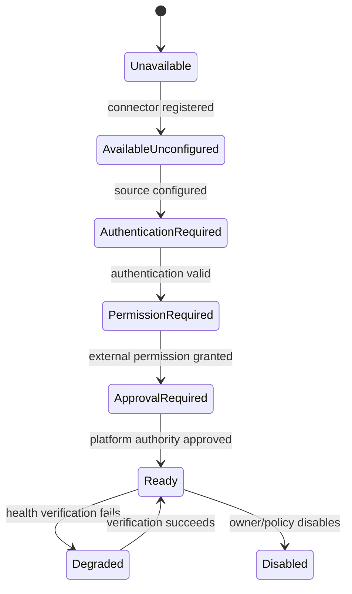

# Capability Registry v0.1

## Purpose

The registry is the Core's truthful inventory of what it can do now, within what
scope, and why it cannot do something else. Installed code alone is not a usable
capability.

## Capability record

| Field | Meaning |
|---|---|
| `capability_id`, `version` | Stable verb-oriented identity and contract version |
| `connector_id`, `provider` | Implementer/source |
| `status` | unavailable, available_unconfigured, authentication_required, permission_required, approval_required, ready, degraded, disabled |
| `operations` | discover, inspect, ingest, sync, search, draft, act, verify |
| `scope` | Source instances, paths, sites, accounts and security domains |
| `permissions_required` | External and platform permissions |
| `authentication_status` | none, missing, valid, expired, error; no credentials stored here |
| `risk_level` | read, ingest, draft, internal_write, external_side_effect, destructive |
| `authority_rule` | Policy decision reference |
| `dependencies` | Other capability/version IDs |
| `last_verified_at`, `health` | Freshness and verification outcome |
| `manifest_hash` | Installed declaration provenance |
| `owner` | Accountable principal/domain |

Registry state is local operational metadata. Permission grants live in the
Permission & Authority store; the registry references their decisions.

## Query examples

```text
can(search_email_memory, principal=owner, domain=EDN)
  -> ready; local; verified 2026-08-10

can(ingest_sms, principal=owner, domain=PERSONAL)
  -> unavailable; no connector installed

can(send_invoice, principal=owner, domain=EDN)
  -> unavailable; Xero connector absent; external-side-effect approval required
```

## State transitions



No automatic transition grants authority. Verification expiry may demote Ready.

## Alpha initial entries

| Capability | Initial adapter/status |
|---|---|
| `search_email_memory` | Existing retrieval wrapper / ready |
| `search_email_entities` | Existing graph retriever / ready when graph schema exists |
| `extract_email_knowledge` | Existing pipeline / ready locally |
| `discover_sharepoint_schema` | Existing PowerShell tooling / approval required per live scope |
| `create_sharepoint_optional_field` | IMS-006A tooling / approval required; exact manifest scope |
| `discover_local_files` | IC-006 target / unavailable until built |
| `ingest_local_file_subset` | IC-006 target / unavailable until built |
| `read_live_outlook`, `read_calendar` | IC-007 target / authentication and permission required |

## Registry API

`register_manifest`, `list_capabilities`, `resolve(capability_id, context)`,
`record_verification`, `record_degradation`, and `explain_gap`. Resolution returns
a decision object, never a boolean only: status, effective scope, missing
dependencies, required permissions/approval, verification age and evidence.

## Persistence and tests

Alpha may use a dedicated SQLite database or isolated schema with migrations.
Do not couple registry lifecycle to the email database. Tests cover deterministic
registration, version conflicts, stale verification, dependency cycles, scope
intersection, disabled capability, missing authentication and explanation of
capability gaps.

