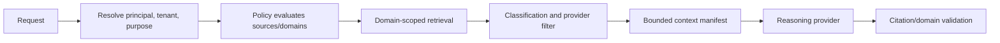

# Context and Security Domain Model

## Security context

Every request has an immutable `RequestContext`:

| Field | Purpose |
|---|---|
| `principal_id`, `roles` | Who is asking |
| `tenant_id` | Which customer/business boundary |
| `active_domains` | PERSONAL, EDN, CLIENT-A, etc. explicitly selected/permitted |
| `purpose` | User task and permitted downstream use |
| `classification_ceiling` | Maximum data handling level |
| `provider_policy` | Local only or approved external providers |
| `session_id` | Conversation isolation |
| `authority_refs` | Applicable temporary approvals |
| `expires_at` | Context lifetime |

Ownership, tenant, domain, classification and permitted purpose are stored on
source/record/evidence metadata. Retrieval repositories require a context filter;
an unscoped query API is not exposed to Intelligence Core.

## Domain examples

```text
PUBLIC
EDN
EDN/CLIENT-A
EDN/CLIENT-B
PERSONAL
PERSONAL/FAMILY
PERSONAL/HEALTH
PERSONAL/FINANCIAL
```

Hierarchy does not automatically grant parent/child access. Policies define
allowed intersections. Client evidence remains client-restricted even when used
inside EDN delivery work.

## Context assembly pipeline



The manifest lists every evidence ID, source, security domain, classification,
purpose, provider, transformation and exclusion. Conversation memory stores
references and decisions, not unrestricted copies of source content.

## Session and follow-up rules

Follow-up turns inherit only the prior session's still-valid context references
and active domains. A principal/domain/purpose/provider change triggers context
reassembly. Evidence removed, reclassified or no longer authorised becomes a
tombstone; it cannot remain in future prompts merely because it appeared earlier.

## Storage isolation

Alpha is single-owner but domain-aware. Prefer separate raw stores by connector
and domain; structured catalogues may share SQLite only if every repository query
requires domain predicates and cross-domain leakage tests pass. Highly sensitive
health/financial/client data should move to physically/access-separated stores
before ingestion. Encryption and OS access controls remain mandatory operational
controls, not inferred from a drive path.

## Threats and controls

| Threat | Control |
|---|---|
| Cross-domain retrieval | Mandatory context parameter and repository-level filter |
| Prompt/context leakage | Bounded manifests; provider classification ceiling |
| Conversation carry-over | Reauthorise every turn/session-domain change |
| Overprivileged connector | Scope intersection; connector cannot widen policy |
| Search-result side channel | Access-filter before ranking/counting/excerpts |
| Sensitive telemetry | Metadata-only metrics; no bodies/prompts |
| Stale permission | verification TTL, tombstones and re-sync |
| Confused deputy action | bind approval to principal, purpose, plan and target |

## Alpha acceptance security tests

Seed synthetic EDN and PERSONAL records with overlapping unique phrases. An EDN
request must not return, count, cite or hint at PERSONAL records. Repeat through
keyword, graph, conversation follow-up, daily brief and provider-context paths.

