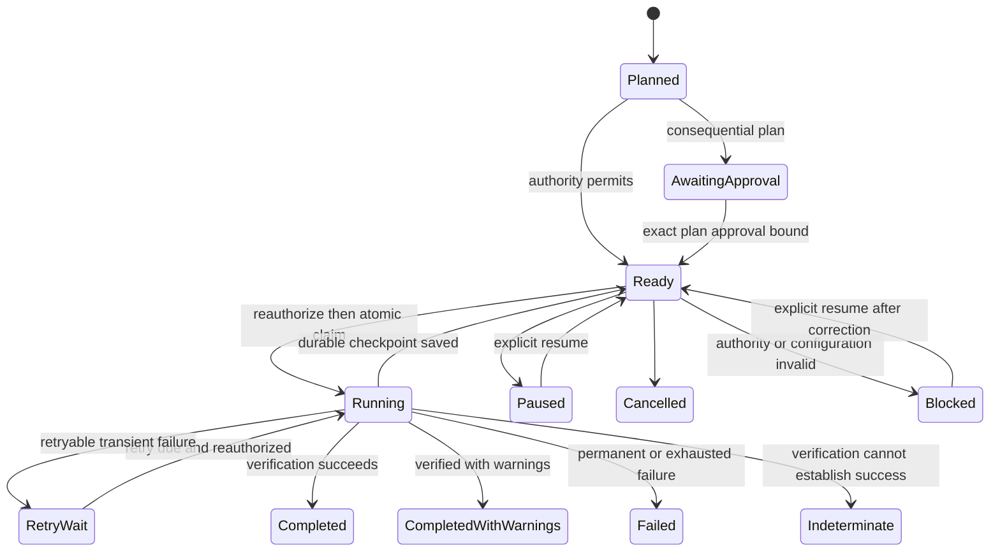

# IC-004 Persistent Jobs, Checkpoints and Audit Trail

## Architecture and boundary

`edn.jobs` is the smallest durable execution boundary for Intelligence Core. A request or UI may create and inspect a job, but execution state lives in a dedicated configurable SQLite database and survives loss of the originating chat or terminal. The package consumes IC-001A security contracts, IC-002 registry/policy decisions, and IC-003 connector protocols; it creates no second authority or connector abstraction.

```text
src/edn/jobs/
  models.py   immutable jobs, retry, progress, result, approval and audit values
  storage.py  schema-versioned SQLite persistence and operational summaries
  service.py  lifecycle transitions and pure execution-time reauthorization
  worker.py   one-shot local claim, connector invocation, retry and verification
```

There is no daemon, polling loop, distributed queue, scheduler, live connector, or UI in IC-004. `LocalJobWorker.run_next()` performs at most one bounded unit of work and is invoked manually by a future CLI/service boundary.

## Job lifecycle



Completed, completed-with-warnings, failed, cancelled, and indeterminate jobs are not claimable. Completed work is therefore not repeated by later worker invocations. Blocked jobs require an explicit resume after policy, capability, approval, connector, or configuration correction.

## Job model

A persisted `Job` retains durable/correlation IDs, job type, connector and version, configuration hash, capability and exact operation, authenticated principal, tenant/domain, purpose, classification, resource scope, optional full content-free `ConnectorPlan`, optional exact `ApprovalBinding`, retry policy, attempts, checkpoint reference, bounded progress, result references, verification state, safe error, and timezone-aware lifecycle timestamps.

Large result payloads are excluded. `JobResultRef` records stable record/evidence/artifact references, counts, and a bounded summary. Credentials and source contents have no job fields.

## SQLite schema and safety

IC-004 creates a dedicated database, never the email-memory database:

- `schema_metadata`: component schema version, initially `1`;
- `jobs`: indexed status/filter columns plus deterministic versioned job JSON;
- `checkpoints`: one current durable IC-003 checkpoint per job;
- `job_attempts`: worker, start/end, outcome and safe error code;
- `audit_events`: ordered append-only event JSON.

Initialization is deterministic. Missing or newer schema versions fail safely. Connections use configurable connection timeout, `busy_timeout`, foreign keys, explicit `BEGIN IMMEDIATE` only for short claim/update transactions, rollback on failure, and the existing SQLite journal mode. WAL is not assumed. Read-only stores use SQLite URI `mode=ro` and cannot initialize or mutate the database.

Audit `UPDATE` and `DELETE` triggers abort at the database layer. Job state and its transition event are written in the same transaction. One-worker atomic claims recheck status under `BEGIN IMMEDIATE` so terminal or concurrently changed jobs cannot be reclaimed.

## Checkpoints and restart recovery

IC-004 reuses IC-003 `Checkpoint`. It binds connector ID/version, configuration hash, operation, source scope, resume marker, last durable count, and creation time. It contains no credential or source payload. Returned checkpoints are compatibility-checked before persistence, and persisted checkpoints are rechecked before resume.

Each resumable connector call represents one durable batch. An incomplete `IngestResult` must include a checkpoint; the worker atomically persists it with progress, returns the job to `ready`, and ends that manual invocation. A later process reconstructs `JobStore`, registry, policy evaluator, connector, and worker, then resumes from the stored durable boundary.

If a process terminates after claim, an operator may call `recover_interrupted`. It requeues a `running` job only when its referenced checkpoint exists and matches the persisted durable record; the stranded attempt is recorded as interrupted. The next worker still performs complete execution-time reauthorization and compatibility checks. Jobs without a matching checkpoint are not guessed safe to replay.

The synthetic 100-item test commits batches of 20. It intentionally attempts items 41–47 and rolls them back, leaving checkpoint/output at 40. New store, worker, and connector objects resume from persisted 40, use duplicate-safe inserts, finish 100 unique items, and verify the final count. No live Python connector state is reused.

## Retry semantics

`RetryPolicy` defines maximum attempts, base delay, exponential backoff, and an explicit set of retryable codes. The worker retries only when all are true:

- the raised structured `ConnectorError` declares itself transient;
- its code is explicitly configured as retryable; and
- the attempt budget remains.

Permission denial, invalid checkpoints, configuration/version drift, source incompatibility, verification failure, and indeterminate safety are not retried. Retry times are persisted and injected clocks keep tests deterministic. Exhaustion transitions to `failed` with a safe reason code.

For multi-batch connectors, the attempt budget must cover expected manual batch invocations plus bounded failures. A later job model may separate batch sequence from failure-attempt count if operational evidence warrants that added complexity.

## Approval and authority binding

Approval-required jobs may be persisted as `awaiting_approval`. `ApprovalBinding` must match the exact plan ID, SHA-256 plan hash, and scope and must remain unexpired. A changed plan hash or expired approval prevents execution. Binding records an `approval_bound` event; job creation with a plan records `plan_bound`.

Persistence never grants lasting authority. Before claim or resume, `reauthorize_job` reconstructs a fresh `PermissionRequest` and requires:

- exact principal/tenant/active-domain eligibility;
- registered capability with matching connector and version;
- currently ready capability state;
- currently usable permission decision;
- unexpired exact approval where the plan requires it; and
- matching worker configuration hash and compatible checkpoint.

Failure blocks the job before `job_claimed` is written or connector code runs. Tests cover PERSONAL under EDN-only context, CLIENT:A under CLIENT:B context, prohibited and expired policy, unavailable capability, plan drift, connector version drift, and configuration/checkpoint drift.

## Worker behavior

The worker examines bounded claim candidates, reauthorizes first, validates connector/configuration/checkpoint identity, atomically claims one job, builds an authority-bound IC-003 `ConnectorRequest`, and invokes the declared connector protocol. It persists incomplete ingestion checkpoints, handles structured failures, verifies final output, and writes only a bounded result reference.

Verification records `verification_started` and `verification_completed`. `verified` produces completed; `verified_with_warnings` produces completed-with-warnings. Failed or indeterminate verification never becomes success and transitions to an indeterminate terminal record requiring review.

## Audit and privacy

Audit events include event/job/type IDs, timestamp, correlation, optional actor, previous/new status, safe reason code, and bounded scalar metadata. Metadata keys containing body, content, payload, token, secret, password, or credential are rejected. String values are bounded and single-line. Raw exceptions, document text, email bodies, connector payloads, and credentials are never persisted.

Events cover creation, plan/approval binding, claims, checkpoints, retry scheduling, pause/resume/cancel, verification, completion, failure, and blocking. Attempts are separately queryable without source content.

## Observability

`JobStore.metrics()` derives status counts, average completed duration, retry count, checkpoint count, and safe failure-reason counts directly from persisted operational metadata. No telemetry backend is required.

## Future boundary

A later minimal CLI may call `run_next()` explicitly. Scheduling can create or wake jobs only after persistence and operational review; it cannot grant authority. Future work may add migrations above schema version 1, automated stale-claim detection with explicit operator policy, usage-limited approvals, atomic coordination with external result stores, and retention/export policy. Distributed queues, daemons, cloud scheduling, and autonomous execution remain outside this design.
