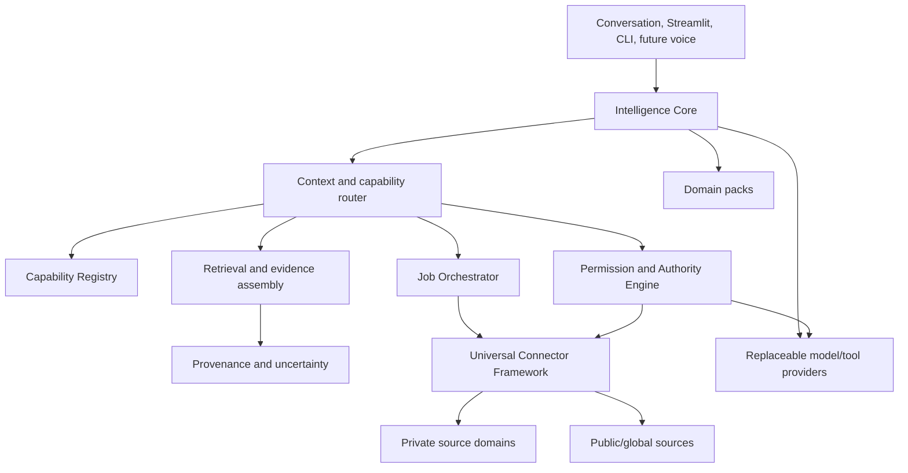
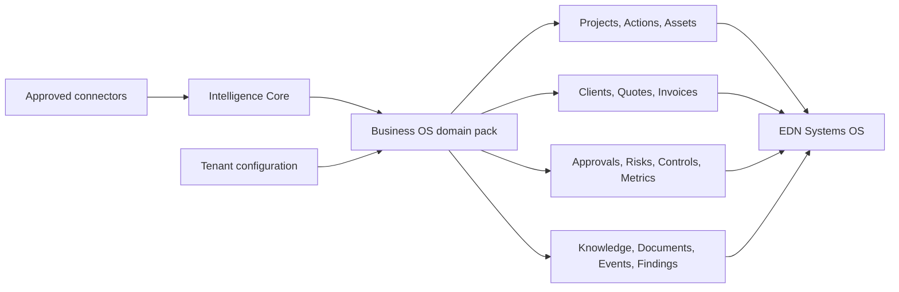

# Intelligence Core v0.1 Architecture

Status: Proposed architecture for approval  
Date: 2026-08-10  
Implementation authority: Documentation only

## Executive summary

Intelligence Core is a local-first, policy-governed intelligence platform. It
assembles only authorised context, selects registered capabilities, retrieves
evidence, distinguishes fact from inference and recommendation, and prepares or
executes actions only within explicit authority.

It is not a universal database, connector collection, agent swarm, business
application, or model provider. Business OS and Personal OS are domain packs
built on the Core. EDN Systems OS is Business OS plus EDN configuration,
connectors and customer-owned data.

The existing email Memory, FTS retrieval, grounded answering, deterministic
knowledge graph, Streamlit UI and controlled SharePoint lifecycle remain working
assets. Alpha wraps them behind narrower contracts and migrates incrementally.

## Naming hierarchy

```text
Intelligence Core                 reusable platform
├── Domain packs
│   ├── Business OS
│   └── Personal OS               conceptual only in v0.1
├── Tenant configuration
│   ├── EDN Systems configuration
│   └── future customer configuration
├── Connectors                    external/source adapters
└── Customer-owned data

Intelligence Core + Business OS + EDN config + connectors + EDN data
= EDN Systems OS
```

Product/interface names remain configuration. “Jarvis” is not a core type,
package, or hard-coded assistant identity.

## Architecture principles

1. Private and global intelligence are separate trust inputs.
2. Context is denied by default and assembled per request, principal, purpose and
   security domain.
3. Sources remain authoritative; derived knowledge always carries evidence.
4. Capabilities are declared and verified, never inferred from installed code.
5. Connectors implement capabilities; the Core orchestrates them.
6. Read, draft, approve and execute are distinct authorities.
7. Long-running work is a resumable job, not a chat-side effect.
8. Local raw data and indexes remain local where practical. Cloud reasoning sees
   only an explicitly approved bounded context.
9. Models are replaceable providers. The platform owns permissions, context,
   provenance, state and action policy.
10. Add source #10 through the same contracts, tests and approval lifecycle used
    by source #2.
11. Existing working code is wrapped before it is refactored.
12. Unknown is not absent; uncertainty is represented in outputs.

## Core architecture



### Intelligence Core responsibilities

- interpret a user objective without silently broadening it;
- determine active principal, purpose and context domains;
- ask the registry what capabilities are available, unavailable or unverified;
- request policy decisions for discovery, retrieval, reasoning and action;
- assemble bounded evidence from permitted retrievers;
- classify output statements as fact, inference, recommendation or proposed
  action;
- report uncertainty, missing information and capability gaps;
- prepare plans and jobs; and
- verify results and register newly verified capability state.

It does not parse PSTs, scan directories, call SharePoint, send invoices or own
business entities directly.

## Private + global intelligence

| Plane | Examples | Default |
|---|---|---|
| Private intelligence | Email, files, calendars, SharePoint, finance, devices, sensors | Local storage; domain-restricted; no cloud disclosure without policy decision |
| Global intelligence | Foundation-model prior knowledge, web, public datasets, specialist tools | Marked external/currentness-aware; cannot be treated as private business fact |
| Reasoning | Bounded combination of approved evidence | Request-specific context manifest records every included source/domain/provider |

Claims derived from both planes cite each plane separately. Global knowledge may
explain a standard concept; it cannot establish an EDN fact without EDN evidence.

## Intelligence modes

| Mode | Output | Minimum authority |
|---|---|---|
| Retrieve | Ranked evidence | Read/search permitted sources |
| Understand | Facts and bounded inferences | Retrieve plus reasoning provider policy |
| Recommend | Options tied to evidence and declared goals | Understand plus recommendation permission |
| Act | Draft, approval request, or execution result | Capability-specific draft/execute authority; human gate where required |

Every response envelope contains `facts`, `inferences`, `recommendations`,
`proposed_actions`, `evidence`, `uncertainties`, `capability_gaps` and
`approval_requirements`. Empty sections remain explicit.

## Goal-driven intelligence

Goals are user/domain records, not facts inferred from behaviour. A goal has ID,
owner, domain, title, desired outcome, priority, horizon, status, source decision
and review date. Recommendations record which goal influenced them. The system
must still surface urgent safety/security issues that conflict with priorities,
while explaining the policy basis.

## Proactive intelligence

Proactive analysis compares authorised current state with prior state,
expectations, deadlines and goals. Alpha limits this to a user-invoked daily
brief. Later scheduled jobs may produce candidate briefs, but external actions
remain gated.

```text
snapshot -> change detection -> policy filter -> relevance ranking
         -> evidence-backed candidate -> user-visible brief
```

## Business OS



Business entities belong to Business OS, not Intelligence Core. The Core sees
them through domain-owned record/evidence and action contracts.

## Personal OS relationship

Personal OS uses the same registry, connector, job, permission, evidence and
provider contracts with different domain models: Family, Health, Fitness,
Property, Finances, Career, Travel, Goals, Messages, Photos, Home and Vehicles.
Personal records never become Business OS context merely because one owner uses
both. A future EDN employee principal receives no PERSONAL, FAMILY, HEALTH or
owner FINANCIAL retrieval grants.

## Provider abstraction

| Provider contract | Purpose |
|---|---|
| `ReasoningProvider` | Structured grounded reasoning over supplied context |
| `ResearchProvider` | Current public/web research with source capture |
| `EmbeddingProvider` | Optional retrieval representations |
| `VisionProvider` | Bounded image/document interpretation |
| `SpeechProvider` | Speech-to-text/text-to-speech |
| `SpecialistToolProvider` | Domain calculation or validation |

Provider requests contain a context manifest, classification ceiling, permitted
purpose, token/size budget and retention rule. Provider responses record provider
ID/version, timestamp, input-evidence IDs, output classification and usage. No
provider receives direct database access.

## Local-first deployment tiers

1. Local raw sources: immutable or connector-controlled source caches.
2. Local structured records and evidence.
3. Local retrieval indexes and deterministic extraction.
4. Optional bounded cloud reasoning under policy.
5. Optional local models behind identical provider contracts.

SQLite remains suitable for Alpha local catalogues/jobs because current scale and
single-owner operation do not justify a distributed database. Stores should be
logically separated by security domain or enforce domain-scoped repositories;
sharing one file never implies cross-domain access.

## Observability

Emit metadata-only telemetry: connector health, job duration/progress/retries,
ingestion throughput, storage growth, indexing latency, retrieval latency,
context size, provider usage, permission denials, approval outcomes, action
verification and provenance coverage. Never log record bodies, prompts containing
private context, secrets or raw provider responses by default.

## Major decisions

| Decision | Rationale |
|---|---|
| Registry before connector proliferation | Lets the system reason honestly about capabilities and gaps |
| Permission decision before context assembly | Prevents retrieval leakage rather than filtering after retrieval |
| Common envelope, source-specific payloads | Avoids both silos and an unusable mega-table |
| Job records before background scheduling | Resumability/audit first; scheduler can remain manual in Alpha |
| Wrap current modules | Preserves production-proven behaviour and lowers migration risk |
| Configuration-owned terminology | Supports future Customer OS products without core forks |

## Technical and security risks

- policy bugs causing cross-domain retrieval;
- false entity resolution merging people or clients;
- stale capability verification;
- connector contract becoming a lowest-common-denominator abstraction;
- source deletion/permission changes not propagating to indexes;
- provenance links resolving to inaccessible or changed evidence;
- cloud context leakage through prompts/telemetry;
- long-running SQLite write contention;
- overbuilding orchestration before a second real connector validates it; and
- recommendations appearing authoritative when evidence is weak.

Mitigate with synthetic cross-domain tests, explicit scopes, fail-closed policy,
versioned contracts, evidence tombstones, checkpoints, read-only repositories,
bounded context manifests and visible epistemic labels.

## Hardware and storage implications

Alpha needs no GPU or vector database. Capacity planning should measure raw
source size, extracted text, SQLite/FTS growth, graph growth and backup time.
Local filesystem discovery stores metadata first. Optional embeddings, image
derivatives and local models are separate later capacity decisions. SSD storage,
encrypted volumes, verified backups and sufficient free space for database
maintenance matter more than accelerator hardware in v0.1.

## Non-goals

No full Personal OS, multi-tenant SaaS, Xero, Garmin, SMS, photos, Home Assistant,
autonomous communications/financial transactions, huge vector store, mobile app,
local-LLM stack or agent swarm. No IMS-006B or SharePoint mutation belongs to
this architecture phase.

