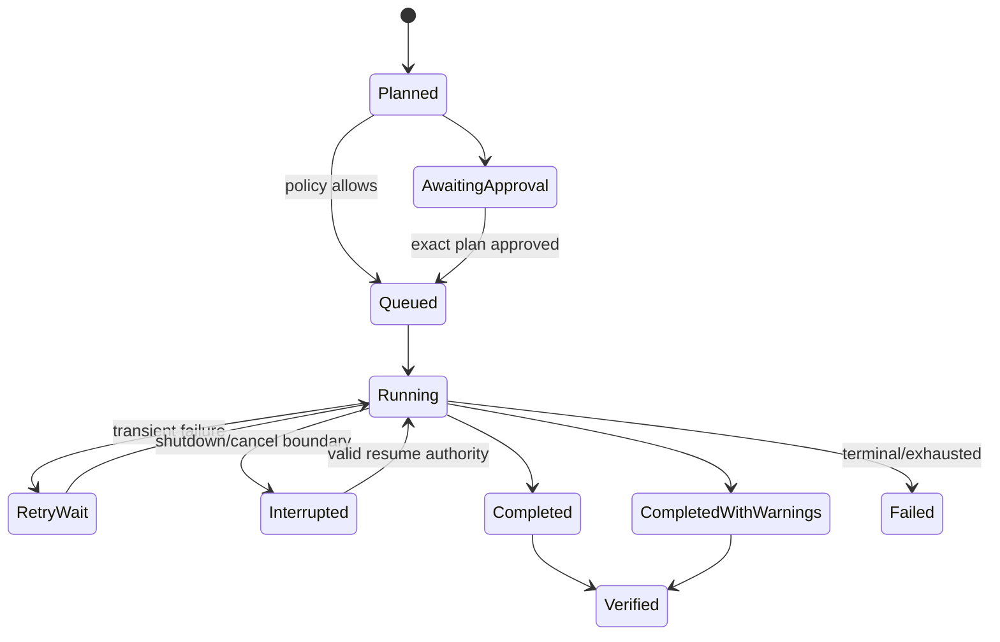

# Job and Orchestration Model

## Decision

Alpha implements persistent job records and checkpoints but not a sophisticated
scheduler or distributed worker system. A CLI/local worker may start and resume
jobs independently of a chat window.

## Job record

| Field | Meaning |
|---|---|
| `job_id`, `job_type`, `version` | Stable identity and handler contract |
| `owner`, `tenant`, `security_domain`, `purpose` | Security context |
| `capability_id`, `connector_id`, `source_id` | Implementation/source |
| `status` | planned, awaiting_approval, queued, running, retry_wait, interrupted, completed, completed_with_warnings, failed, cancelled |
| `plan_hash`, `authority_decision_id` | Exact approved work |
| `created/started/updated/completed_at` | Audit timeline |
| `progress` | Processed/planned counts and current phase; no private content |
| `checkpoint` | Versioned opaque connector state and last durable boundary |
| `attempt`, `max_attempts`, `next_retry_at` | Bounded retry |
| `result_ref`, `error_code` | Protected output and sanitized failure |
| `verification` | Expected versus actual, hashes/counts and status |

## State machine

An expired approval prevents resume. A changed Plan creates a new approval, not a
mutated job history.

## Transaction/checkpoint rules

- Connector batches define durable checkpoint boundaries.
- Persist output then checkpoint atomically where one store permits; otherwise
  use idempotency keys and reconciliation.
- Retrying a committed batch is duplicate-safe.
- Cancellation is cooperative between records/batches; never corrupt a source or
  partially mark an uncommitted batch complete.
- Verification reconciles planned, processed, created/updated, skipped, failed
  and remaining counts.

Current email importer batch commits, progress callbacks, lock retries and graph
`last_email_id` checkpoint are reference implementations to wrap, not replace.

## Scheduling and proactive work

Alpha jobs are launched explicitly. A simple local scheduler may be added only
after job persistence is stable; schedules create jobs under a pre-approved
policy but cannot grant new source/action authority. Daily brief generation may
run on schedule, while external actions remain separate approval-gated jobs.

## Observability and privacy

Metrics include queue time, duration, throughput, retries, checkpoint age,
failure code, storage delta and provenance coverage. Logs exclude record bodies,
filenames when classified, credentials, raw exceptions and action payloads.

## Required tests

- interruption/resume and duplicate-safe replay;
- transient retry and exhaustion;
- expired approval on resume;
- checkpoint schema upgrade/refusal;
- cancellation at a durable boundary;
- result reconciliation and partial warnings;
- cross-domain worker refusal; and
- restart without an open UI/chat process.

