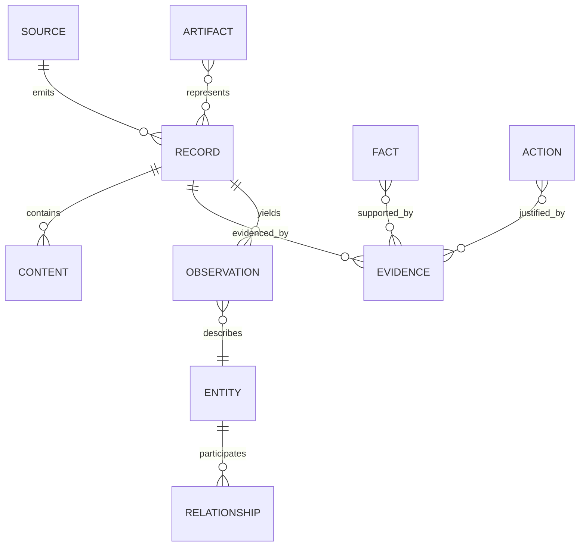

# Universal Record and Evidence Model

## Design

Use common envelopes with typed source payloads—not one flat universal table.



## Canonical primitives

| Primitive | Canonical responsibility |
|---|---|
| Source | Connector/source instance, owner, domain, scope and verification |
| Record | Stable source identity, timestamps, classification, lifecycle and typed payload reference |
| Content | Text/binary/structured parts and hashes; may remain source-local |
| Observation | Time-bound measurement/statement extracted or reported |
| Event | Something that occurred over time |
| Entity | Durable identity such as person, project, asset, property or invoice |
| Fact | Asserted proposition with status/confidence and evidence set |
| Relationship | Typed, temporal connection between entities/records |
| Evidence | Resolvable support pointer, source version/hash and access domain |
| Artifact | Produced file/draft/report with derivation manifest |
| Action | Proposed/approved/executed change with authority and verification |

Domain packs own entity and payload schemas. The Core owns envelope contracts,
evidence/provenance vocabulary and cross-domain-safe identifiers.

## Record envelope

```text
record_id                 platform UUID/ULID
record_type               namespaced type, e.g. communication.email
source_id
source_record_key         stable connector-native/fallback identity
source_version            optional ETag/version/fingerprint
occurred_at / observed_at / ingested_at
owner_id / tenant_id / security_domain
classification / permitted_purposes
payload_schema / payload_ref
content_refs
lifecycle                 active, superseded, deleted, inaccessible
provenance                connector/job/checkpoint/version
```

`source_id + source_record_key` is unique. Current `EmailRecord` remains the
email payload model during Alpha and is wrapped rather than flattened.

## Evidence model

Evidence contains evidence ID, target claim/fact/action, source record/version,
locator (URI plus optional fragment), extraction/transformation, captured-at,
content hash where available, domain/classification, accessibility and supporting
or contradicting role. Evidence URIs are resolvable through the owning connector;
they do not bypass source permissions.

## Epistemic states

Facts use `asserted`, `corroborated`, `disputed`, `superseded`, or `unknown` plus
confidence and evidence. Inferences record method/provider/version and premises.
Recommendations reference facts/inferences and goals. Unknown is never encoded as
false. AI-generated candidates are not canonical facts before review/policy.

## Source-specific examples

- Email: current `EmailRecord` payload; participants/entities and graph facts cite
  `source_record_key`.
- SMS: message payload with thread/participants; Person relationship cites SMS.
- Invoice: finance-domain payload; amount/status facts cite invoice version.
- Photo: metadata/content reference remains in photo connector; derived entities
  cite image hash and region/version.
- Sensor reading: time-series payload may remain specialised; observations expose
  bounded evidence.

## Change and deletion

Sync records source versions. Source deletion or lost access creates a tombstone,
invalidates retrieval content and marks dependent facts `evidence_unavailable`;
it does not silently erase audit history. Reprocessing is idempotent by stable
source identity and extractor version.

